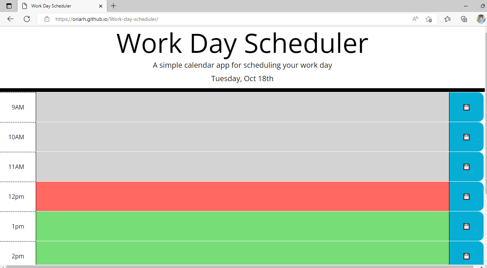

# Work Day Scheduler

## Descriptions 
This simple application allows users to make a schedule for their day and save it. 

## URL
https://oriarh.github.io/Work-day-scheduler/

## Screenshot

## Installation
N/A

## Usage
When the user opens the above provided URL, they are presented with a clean and simple interface with time blocks and their respective save buttons. 

The user can type any event for the day and click the save button to save it to local storage.

The color of the time blocks also changes depending on current time.

Even after the page is reloaded they will still have their event saved.

This web app was built using HTML and CSS, Bootstrap & JQuery.

## Credits
UC Berkeley Extension Instructional Staff
Google Fonts
Bootstrap CDN

## License
MIT License
